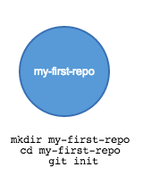
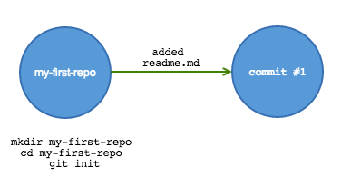
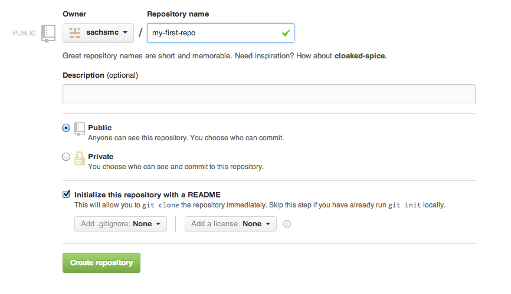
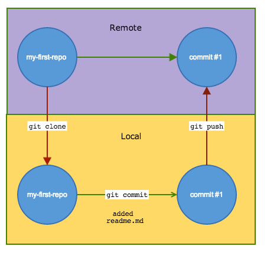
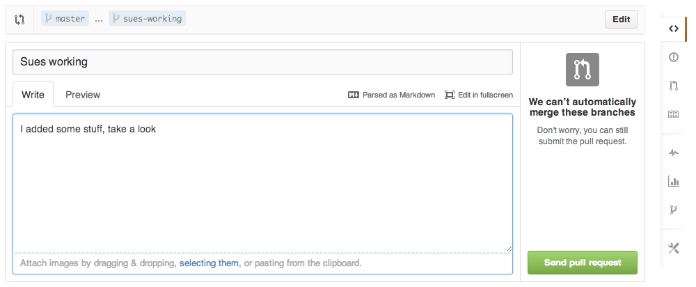
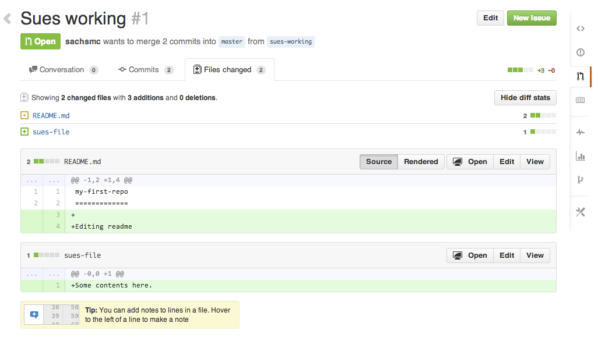

`git` and github
=================

Introduction
---------------

> Your closest collaborator is you six months ago, but you don't reply emails. 

> -Paul Wilson

`git` and [github](http://github.com) are tools to make version control and collaboration easier. Writing code, papers, presentations, and other scientific products requires iteration and input from multiple sources. *Ad hoc* approaches suffer from a variety of problems that occasionally have disastrous consequences. The following examples illustrate some of these problems. 

### Example 1: Reverting changes

A recent paper I worked on used data from a disease registry, which released "frozen" databases quarterly. While working on the revisions, a new database was released. I used to new database to update the analysis because it contained the most reliable and up to date information. After completing the revisions, I received this email from the lead author (this was in 2013 btw): 

> As you can see from the paper I sent you, it is almost complete and I do not want to re-write it.  Therefore, I just want the data described in the e-mail below from the June 1, 2011 data freeze.  ... Is it possible to reconstruct the data inquiry as per what was originally delivered?

I had not saved prior versions of the analysis code, not to mention the manuscript with all of the results incorporated into the text. My only option at that point was to start over.

### Example 1b: Collaborating on an analysis

Another statistician took over an analysis for a manuscript that I thought was complete. Here is a real email exchange

>The manuscript says that out of 1350 participants there were 411  with incident AFib.
However, when I run your code to create the dataset, I only end up with 232. The AFib data came from a file called “mathew_main”.  Did you use anything else to get the extra AFib cases?

My response:

>I'm not 100% sure about anything without looking at my code. Which file are you going on? There should be a dated .Rnw file my Afib folder that contains all the analysis code. I believe that calls an R script called "load-data-chs.R". The mathew_main file does not sound familiar, I suspect that is from a very old version of the paper. 

:(

### Example 2: Incorporating edits on a manuscript

Applied papers that I've worked on had between 5 and 13 authors. Inevitably, a "final" draft of the manuscript (usually a Word document) gets circulated *via* email and comments or suggestions are solicited. Here are the typical types of responses that I get:

* A new word document with tracked changes
* A new word document with untracked changes
* Suggestions listed in the body of an email
* A txt file with suggested changes
* A scanned copy of the paper with hand-written edits
* No response

The challenge is to incorporate (or not) all of the changes from a variety of collaborators, while keeping a record of who has contributed what. 

### Example 3: Sharing content

Once a paper gets published, occasionally people want to use or extend the method. 

> I would be very grateful if you are able to help me implement this tool in my dataset as well.

 
> Could you please send me your code so that I can try to apply it to my example? 

 
>Would you please kindly e-mail me your article and other works in that field promptly.?


**Email is an ineffective tool for sharing code, data, documents**

What are `git` and github?
----------------

`git` is a system for formal version control. The manpage describes it as "the stupid content tracker". It was developed to manage the source code for Linux. Now it is used to track text files, code, and more. Files are organized into **repositories** in which users **commit** changes and/or additions. The entire history of **commits** and their comments are stored by `git` so that at any point, you can view the differences between current and past versions. It comes preinstalled in Linux and OSX. Type `man git` at the console for more information. 

Github [(www.github.com)](http://github.com) is a website that hosts `git` repositories. It provides an interface for exploring repositories, viewing code, downloading repositories, and interacting with collaborators. It also provides some handy services like website hosting, markdown rendering, and training. 

There are alternative to github. The one that I'm aware of is called [Bitbucket](http://bitbucket.org). *You don't need to use a web host to use `git`*. You can use `git` locally to track content (on a network drive, for instance). 


How do I use them? 
------------------

### Getting started

Begin tracking the contents of a folder by using `git init`. This creates a hidden file that tells `git` what files to track. Congratulations, you've created your first repository!



Now add content to the folder. Copy over documents or code, or create new files. Here we will make a simple readme file in [markdown](http://rmarkdown.rstudio.com) syntax. 

```
echo "This is a *readme* file for my-first-repo" > readme.md
```

Check the status of the tracker by running `git status`. It will inform you that a file has been changed but it is not tracked: 

```{bash}
On branch master

Initial commit

Untracked files:
  (use "git add <file>..." to include in what will be committed)

	readme.md

nothing added to commit but untracked files present (use "git add" to track)

```

Track the new files (the `.` means add everything in the directory): 
```{bash}
git add .
``` 
Checking the status again, we see that the changes are **staged**, meaning ready to be committed. 

```{bash}
my-first-repo sachsmc$ git status
On branch master

Initial commit

Changes to be committed:
  (use "git rm --cached <file>..." to unstage)

	new file:   readme.md
```

Commit the changes making sure to include a detailed description of what was changed. 

```{bash}
my-first-repo sachsmc$ git commit -m "Added readme.md"
[master (root-commit) f92799f] Added readme.md
 1 file changed, 1 insertion(+)
 create mode 100644 readme.md
```

Now this is what the repository history looks like:




### Remote repositories


Github makes it easy to centralize and share your work. All of the above steps can be accomplished in the github web interface. From the repositories tab, click on **new repository**


Git your repo a name, and click the option to initialize with a readme. Finally, click **create repository**




There are several ways to interact with a remote repository. **Clone** a repository to copy it to your local working drive. After making changes, **commit** them locally, then **push** the commit back to the remote repository. Doing this ensures that the *entire commit history* is saved to the remote repository. 



If you change computers, or have a hard-drive failure, or you aren't sure what local folder is most up-to-date, simply clone the remote repository and continue working. 

Github provides desktop applications for Windows, OSX, and Linux. Using these applications makes interacting with remotes much easier. See this link for resources to get started with whichever OS you prefer https://help.github.com/categories/54/articles. 

Collaborating with Github
------------------

Let's learn how to use github by walking through the lifecycle of a scientific article. Let's say I'm working on a paper with my friend Sue. The paper involves some statistical analysis of real data, and some simulation studies. Sue is the expert on the data example and application, while I'm taking the lead on the manuscript. Create an initial commit. I come up with an inital draft `.tex` file, some analyses in `.R` together with all the associated data and output. I make commits at appropriate stopping points. 

### Branching and merging

Sue is ready to work on the paper. Instead of working on the same repo, she creates a new **branch**. By default, the main branch is called `master` which represents the most stable version of the content. Sue makes a branch called `sues-working`. She edits the files as she sees fit, adding, changing, and making commits along the way. Changes she commits do not affect the `master`. I also continue working and making commits. 


When Sue is finished making her contributions, she is ready to merge the `sues-working` branch back into `master`. To accomplish this, she will push all of her changes to github, then **submit a pull request**. 



A **pull request** is a request to incorporate changes from one branch into another. It doesn't merge them automatically, but rather opens a discussion about possible changes. The repo owner can review the changes, make comments, and suggest edits before merging. Here we can fully harness the power of `git` and `diff`. You can see that every addition, deletion, and change is highlighted in the window. You can make general comments on the request, add comments to specific lines of code, and create **issues**. You can see that **conflicts** are highlighted in yellow. Conflicts arise when the same line is edited in different ways. To resolve a conflict, the file must be edited on one of the branches and committed. Changes that can be merged without conflict are in green. 



The github desktop application will prompt you to resolve any merge conflicts. It will open up a text editor, showing each conflicting line. You can remove the conflict by choosing from the two options or combining the two in some way. Commit all the changes and the branches can be merged. Again, the entire commit history is saved along with any discussion of issues!

See https://help.github.com/articles/resolving-merge-conflicts for more information about conflicts. 


### Smaller contributions

For small changes such as typos or rephrasing, collaborators can edit files directly in the github web interface. Pressing submit proposes the file changes that the owner can accept, reject, or modify. 


More expansive or general suggestions can be submitted as **issues**. Many options exist for issues. You can label them, drag and drop images as support, assign specific collaborators to resolve them, and more. **Milestones** are a way to schedule and track big steps, such as journal submission. Once you create a milestone with a due date, you can attach specific issues that need to be achieved to reach that milestone. 


Conclusion
-----------

This was a brief introduction to using git and github for collaboration. It is a bit of a commitment to learn and use, but the benefits are enormous. You will save the entire history of changes to a project, you can go back to any point in time (and see what has changed between any two points in time), you don’t have to worry about breaking things that work, and you can easily merge changes from multiple people.

There are many more features available and more are introduced as github develops. Here are some links to continue exploring the word of version control. 

 Topic | Link 
 ------|------
KBroman's guide | http://kbroman.github.io/github_tutorial/
Github tutorials | http://guides.github.com/
Possible workflows | http://www.atlassian.com/git/workflows
Another tutorial | http://www.atlassian.com/git/tutorial
Github website hosting | http://pages.github.com/ 
Bitbucket alternative | http://bitbucket.org


